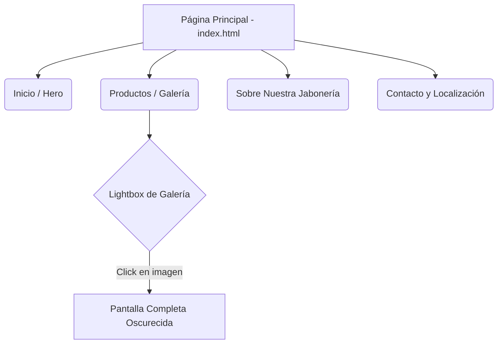

# La Jabonería de Marseille Asturiana
[la jaboneria](https://teeki.es/examen/)

Una aplicación web y **Progressive Web App (PWA)** para un establecimiento asturiano situado en Gijón, dedicado a la fabricación y venta de auténtico jabón de Marsella artesanal con ingredientes naturales.

## 🚀 Características Principales

*   **Diseño Adaptable (Responsive)**: Interfaz optimizada para todos los dispositivos (móviles, tablets y escritorio).
*   **Progressive Web App (PWA)**: Implementación de Service Worker (`sw.js`) y Manifest para permitir el funcionamiento offline (sin conexión a internet) y su instalación nativa en dispositivos.
*   **Galería Interactiva**: Visualizador de imágenes tipo *Lightbox* desarrollado con JavaScript puro, que incluye animaciones sutiles y elegantes al pasar el cursor (efecto hover).
*   **Menú de Navegación Móvil**: Menú hamburguesa interactivo construido íntegramente con CSS.
*   **Navegación Suave (Smooth Scroll)**: Transiciones suaves al desplazarse entre las distintas secciones de la página.
*   **SEO Básico**: Etiquetas semánticas y meta descripciones optimizadas.
*   **Mapa Integrado**: Ubicación del establecimiento en la Plaza Mayor de Gijón mediante iframe de Google Maps.

## 🛠️ Tecnologías Utilizadas

*   **HTML5**: Estructura semántica de los datos y el contenido.
*   **CSS3**: Estilos personalizados, CSS Grid, Flexbox y animaciones (Vanilla CSS, sin frameworks).
*   **JavaScript (ES6)**: Lógica para la interactividad (Vanilla JS).
*   **Service Workers API**: Para el almacenamiento en caché de imágenes y recursos.

## 📁 Estructura del Proyecto

*   `index.html`: Archivo base con la estructura de la página principal.
*   `style.css`: Hoja de estilos donde se define la apariencia visual y el menú móvil.
*   `script.js`: Archivo con la lógica de la aplicación (animaciones del scroll, comportamiento del lightbox).
*   `sw.js`: Service Worker encargado del caché de los archivos estáticos.
*   `manifest.json`: Archivo de configuración PWA para la instalación de la aplicación.

## 📍 Estructura de la Web (One-Page)

## ⚙️ Cómo ejecutar el proyecto localmente

1.  Clona o descarga esta carpeta de proyecto en tu equipo local.
2.  Dado que el proyecto incluye un **Service Worker**, es recomendable utilizar un servidor local (como *Live Server* en Visual Studio Code o `npx serve`) en lugar de abrir el archivo HTML directamente con un doble clic, para que la caché PWA funcione correctamente.
3.  Abre la dirección `localhost` asignada por tu servidor en tu navegador.
4.  ¡Explora la tienda!

## 📝 Notas de Desarrollo
*   El proyecto no utiliza frameworks externos como Bootstrap o Tailwind, apostando por código a medida para mayor ligereza.
*   El esquema de fuentes se nutre de Google Fonts (*League Spartan*).
